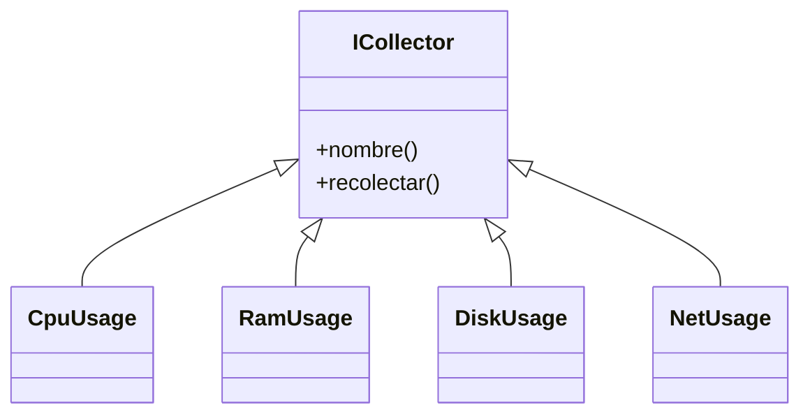
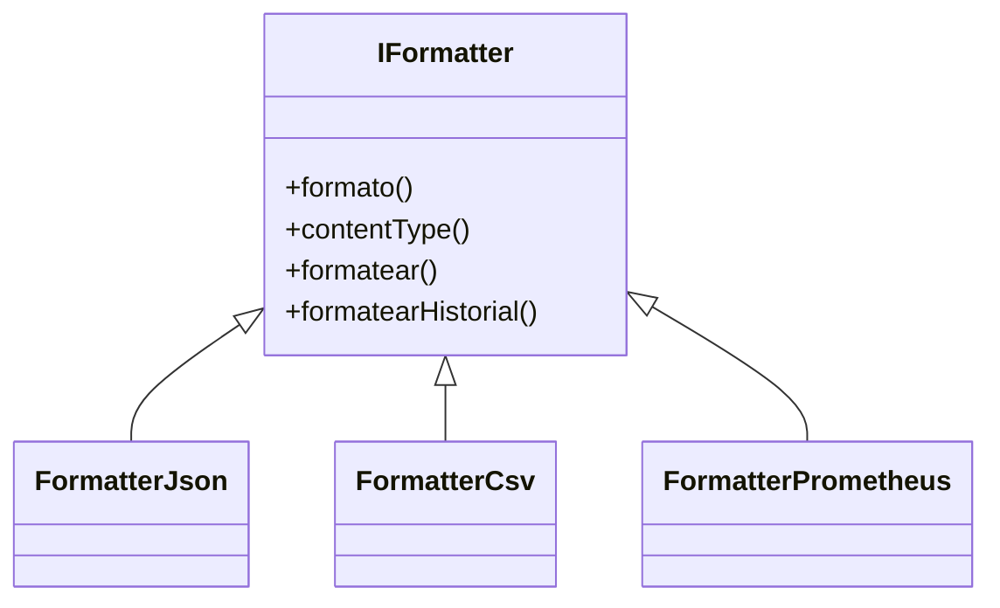
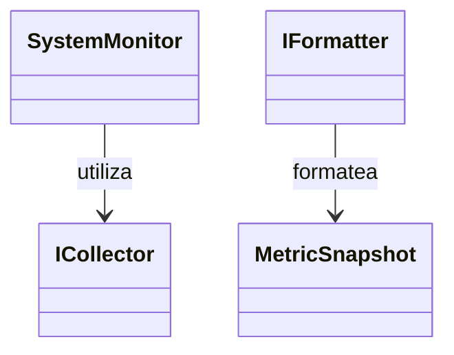
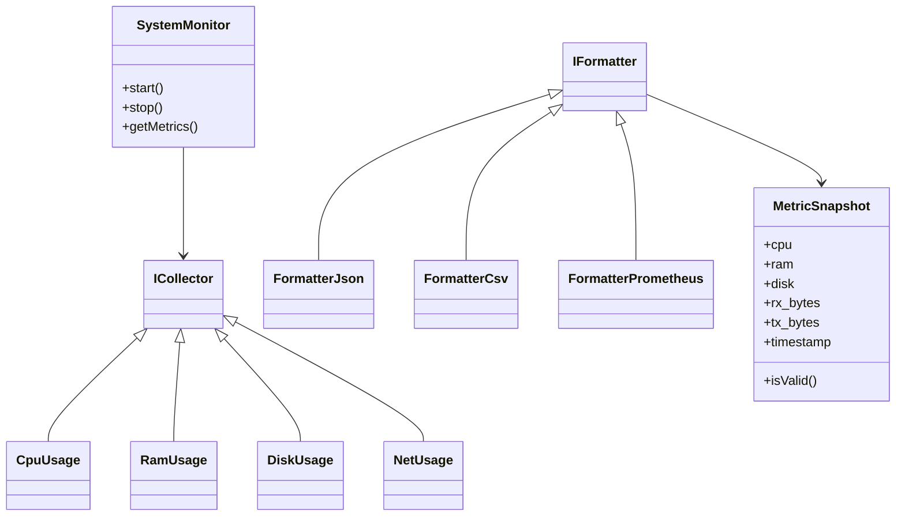

# Arquitectura de clases de Pulso

## Introducción

Este documento describe la arquitectura de clases principal del proyecto Pulso, incluyendo interfaces, relaciones de herencia, relaciones de uso y estructuras de datos utilizadas para la recolección, procesamiento y formateo de métricas.

---

## Clases principales

### Recolectores (Collectors)

Los recolectores obtienen información del sistema operativo y exponen una interfaz común mediante `ICollector`.

* ICollector
* CpuUsage
* RamUsage
* DiskUsage
* NetUsage

### Formateadores (Formatters)

Los formateadores convierten los datos recolectados a distintos formatos de salida.

* IFormatter
* FormatterJson
* FormatterCsv
* FormatterPrometheus

### Núcleo del sistema

* SystemMonitor
* MetricSnapshot

---

## Estructura MetricSnapshot

`MetricSnapshot` almacena una instantánea de las métricas del sistema.

Campos principales:

* cpu
* ram
* disk
* rx_bytes
* tx_bytes
* timestamp

Métodos principales:

* MetricSnapshot()
* MetricSnapshot(...)
* isValid()

---

## Clase SystemMonitor

Responsable de coordinar la recolección y consulta de métricas.

Métodos principales:

* SystemMonitor()
* start()
* stop()
* getMetrics()

Atributos:

* metrics : std::map<std::string, double>

---

## Relaciones de herencia

---

## Relaciones de herencia de formateadores

---

## Relaciones de uso

---

## Arquitectura general

---

## Configuración

El proyecto utiliza estructuras de configuración definidas en los módulos de configuración para controlar el comportamiento del monitor, frecuencia de muestreo y parámetros de ejecución.

---

## Alertas

La carpeta `src/alertas` está reservada para la implementación del sistema de alertas. Actualmente no contiene clases concretas implementadas.

Las futuras implementaciones podrán incluir componentes como:

* GestorAlertas
* AlertaUmbral

para la evaluación y notificación de eventos basados en métricas.
