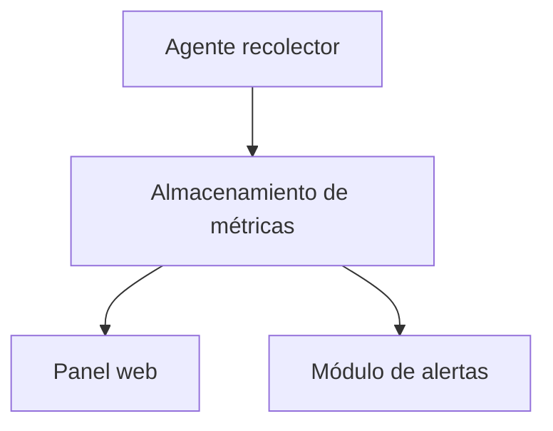

# Arquitectura del Sistema

## ¿Qué es arquitectura de software?

La arquitectura de software es la estructura general de un sistema: define qué partes lo componen, qué responsabilidad tiene cada una y cómo se comunican entre sí. Una buena arquitectura hace que el sistema sea más fácil de entender, mantener y escalar.
En Pulso, la arquitectura responde a una pregunta concreta: ¿cómo viaja la información desde el hardware del servidor hasta el usuario que la consulta?

## Visión general

El sistema permite recolectar métricas del sistema como CPU, RAM y red mediante un agente recolector. Estas métricas son almacenadas y posteriormente visualizadas en un panel web. Además, el sistema incluye un módulo de alertas que permite detectar condiciones críticas y notificar al usuario.

---

## Componentes principales

* **Agente recolector:** Se ejecuta en el sistema y obtiene métricas como uso de CPU, RAM y red.
* **Almacenamiento de métricas:** Guarda los datos recolectados para su posterior análisis.
* **Panel web:** Permite visualizar las métricas en tiempo real o de forma histórica.
* **Módulo de alertas:** Evalúa las métricas y genera alertas cuando se superan ciertos umbrales.

## ## Comunicación entre componentes

Cada componente tiene una forma definida de intercambiar información con los demás:

* **El Agente recolector** lee las métricas directamente desde las APIs del sistema operativo (/proc en Linux, WinAPI en Windows) y las envía al almacenamiento mediante HTTP.
* **El Almacenamiento de métricas** recibe los datos del agente, los persiste y los expone para que otros componentes puedan consultarlos.
* **El Panel web** consulta el almacenamiento para mostrar las métricas al usuario, ya sea en tiempo real o de forma histórica.
* **El Módulo de alertas** lee del almacenamiento de forma periódica, evalúa si alguna métrica supera un umbral definido y notifica al usuario en caso de detectar una condición crítica.

---

## Diagrama de arquitectura

---

## Tecnologías utilizadas

| Componente            | Tecnología   | Versión | Justificación |
|----------------------|-------------|--------|--------------|
| Lenguaje principal   | C++         | C++17  | Alto rendimiento y control de memoria |
| Compilador           | GCC / Clang | -      | Compatibilidad y eficiencia |
| Build system         | CMake       | -      | Facilita la compilación del proyecto |
| Panel web            | HTML/CSS/JS | -      | Visualización en navegador |

---

## Decisiones de diseño

### Decisión 1

**Contexto:**
Se necesitaba un lenguaje eficiente para recolectar métricas del sistema en tiempo real.

**Decisión:**
Se eligió C++ en lugar de Python.

**Consecuencias:**

* Mayor rendimiento y menor uso de recursos.
* Mayor complejidad en el desarrollo.

### Decisión 2

**Contexto:**
Se necesitaba una forma de separar la recolección de métricas de su almacenamiento y visualización, para que cada parte pueda evolucionar de forma independiente.

**Decisión:**
Se adoptó una arquitectura por componentes desacoplados: Agente, Almacenamiento, Panel web y Módulo de alertas con responsabilidades bien definidas.

**Consecuencias:**

* Es posible reemplazar o mejorar un componente sin afectar a los demás.
* El sistema es más fácil de mantener y extender a futuro.

### Decisión 3

**Contexo:**
Se necesitaba que Pulso funcionara en múltiples sistemas operativos (Windows, Linux y macOS) sin tener que reescribir el código para cada uno.

**Decisión:**
Se eligió CMake como sistema de construcción multiplataforma

**Consecuencias:**

* Un único conjunto de instrucciones de compilación sirve para los tres sistemas operativos.
* Incorporar nuevos colaboradores al proyecto es más sencillo independientemente de su entorno.

---

## Flujo de datos

1. El agente recolector obtiene métricas del sistema (CPU, RAM, red).
2. Las métricas se envían al almacenamiento.
3. El almacenamiento guarda los datos.
4. El panel web consulta las métricas para mostrarlas al usuario.
5. El módulo de alertas analiza los datos y genera notificaciones si es necesario.

