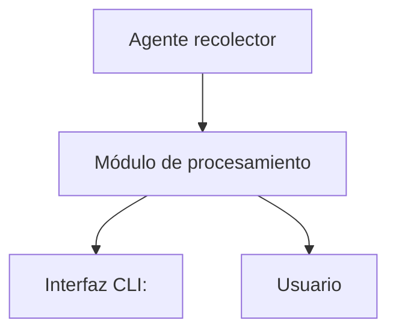

# Arquitectura del Sistema

## ¿Qué es arquitectura de software?

La arquitectura de software es la estructura general de un sistema: define qué partes lo componen, qué responsabilidad tiene cada una y cómo se comunican entre sí. Una buena arquitectura hace que el sistema sea más fácil de entender, mantener y escalar.
En Pulso, la arquitectura responde a una pregunta concreta: ¿cómo viaja la información desde el hardware del servidor hasta el usuario que la consulta?

## Visión general

Pulso es una herramienta de línea de comandos desarrollada en C++ que permite recolectar y visualizar métricas del sistema como CPU, RAM, disco y red de forma centralizada. Su diseño prioriza el alto rendimiento y el bajo consumo de recursos, operando directamente sobre las APIs del sistema operativo.

---

## Componentes principales

* **Agente recolector:** Se ejecuta en el sistema y obtiene métricas como uso de CPU, RAM, disco y red consultando directamente las APIs del sistema operativo.
* **Módulo de procesamiento:** Recibe los datos del agente, los organiza y los prepara para ser presentados al usuario.
* **Interfaz CLI:** Permite al usuario interactuar con Pulso desde la terminal, ya sea mediante el menú interactivo o a través de argumentos como --status.

---

## Diagrama de arquitectura

## Comunicación entre componentes

Cada componente tiene una responsabilidad definida y se comunica con el siguiente en una cadena lineal:

* El Agente recolector consulta las APIs del sistema operativo (/proc en Linux, WinAPI en Windows, sysctl en macOS) para obtener las métricas actuales de CPU, RAM, disco y red.
* El Módulo de procesamiento recibe esos datos, los organiza y determina qué información presentar según la acción solicitada.
* La Interfaz CLI toma los datos procesados y los muestra al usuario en la terminal, ya sea en formato de menú interactivo o como respuesta directa a un argumento como --status.

---

## Tecnologías utilizadas

| Componente            | Tecnología   | Versión | Justificación |
|----------------------|-------------|--------|--------------|
| Lenguaje principal   | C++         | C++17  | Alto rendimiento y control directo sobre los recursos del sisitema |
| Compilador           | GCC / Clang / MSVC| -      | Compatibilidad con Windows, Linux y macOS |
| Build system         | CMake   | -      | Facilita la compilación multiplataforma del proyecto |
| Interfaz de usuario  | CLI (ter minal) | -      | Acceso directo, ligero y sin dependencias externas |

---

## Decisiones de diseño

### Decisión 1

**Contexto:**
Se necesitaba un lenguaje eficiente para recolectar métricas del sistema en tiempo real.

**Decisión:**
Se eligió C++ en lugar de Python u otros lenguajes de alto nivel.

**Consecuencias:**

* Mayor rendimiento y menor uso de recursos del siistema.
* Control directo sobre la memoria y los procesos del sistema operativo. 
* Mayor complejidad en el desarrollo comparado con lenguajes interpretados.

### Decisión 2

**Contexto:**
Se necesitaba que Pulso funcionara en múltiples sistemas operativos (Windows, Linux y macOS) sin reescribir el código para cada uno.

**Decisión:**
Se eligió CMake como sistema de construcción multiplataforma.

**Consecuencias:**

* Un único conjunto de instrucciones de compilación funciona en los tres sistemas operativos soportados.
* Facilita la incorporación de nuevos colaboradores independientemente de su entorno de desarrollo.

### Decisión 3

**Contexto:**
Se necesitaba definir cómo el usuario interactuaría con el sistema para consultar las métricas.

**Decisión:**
Se adoptó una interfaz de línea de comandos (CLI) con dos modos de uso: menú interactivo y argumentos directos (--status).

**Consecuencias:**

* La herramienta es ligera y no requiere dependencias externas para su visualización.
* Es accesible desde cualquier terminal en los sistemas operativos soportados.
* Resulta especialmente útil para desarrolladores y equipos técnicos que trabajan en entornos de servidor.

---

## Flujo de datos

1. El usuario ejecuta Pulso desde la terminal (./pulso o ./pulso --status).
2. El agente recolector consulta las métricas del sistema al sistema operativo.
3. El módulo de procesamiento organiza y prepara los datos obtenidos.
4. La interfaz CLI presenta la información al usuario en la terminal.
