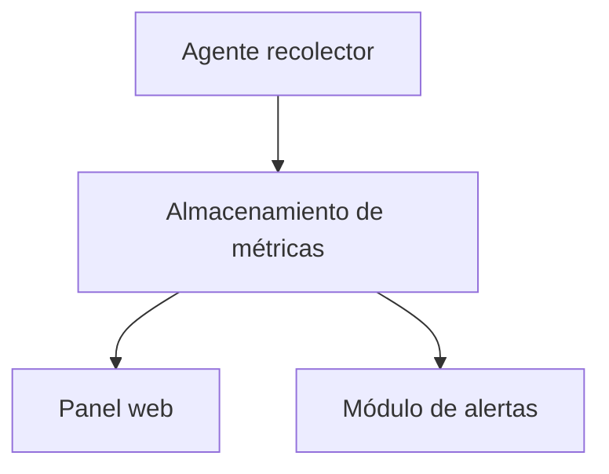

# Arquitectura del Sistema

## Visión general

El sistema permite recolectar métricas del sistema como CPU, RAM y red mediante un agente recolector. Estas métricas son almacenadas y posteriormente visualizadas en un panel web. Además, el sistema incluye un módulo de alertas que permite detectar condiciones críticas y notificar al usuario.

---

## Componentes principales

* **Agente recolector:** Se ejecuta en el sistema y obtiene métricas como uso de CPU, RAM y red.
* **Almacenamiento de métricas:** Guarda los datos recolectados para su posterior análisis.
* **Panel web:** Permite visualizar las métricas en tiempo real o de forma histórica.
* **Módulo de alertas:** Evalúa las métricas y genera alertas cuando se superan ciertos umbrales.

---

## Diagrama de arquitectura

---

## Tecnologías utilizadas

| Componente            | Tecnología   | Versión | Justificación |
|----------------------|-------------|--------|--------------|
| Lenguaje principal   | C++         | C++17  | Alto rendimiento y control de memoria |
| Compilador           | GCC / Clang | -      | Compatibilidad y eficiencia |
| Build system         | CMake       | -      | Facilita la compilación del proyecto |
| Panel web            | HTML/CSS/JS | -      | Visualización en navegador |

---

## Decisiones de diseño

### Decisión 1

**Contexto:**
Se necesitaba un lenguaje eficiente para recolectar métricas del sistema en tiempo real.

**Decisión:**
Se eligió C++ en lugar de Python.

**Consecuencias:**

* Mayor rendimiento y menor uso de recursos.
* Mayor complejidad en el desarrollo.

---

## Flujo de datos

1. El agente recolector obtiene métricas del sistema (CPU, RAM, red).
2. Las métricas se envían al almacenamiento.
3. El almacenamiento guarda los datos.
4. El panel web consulta las métricas para mostrarlas al usuario.
5. El módulo de alertas analiza los datos y genera notificaciones si es necesario.
