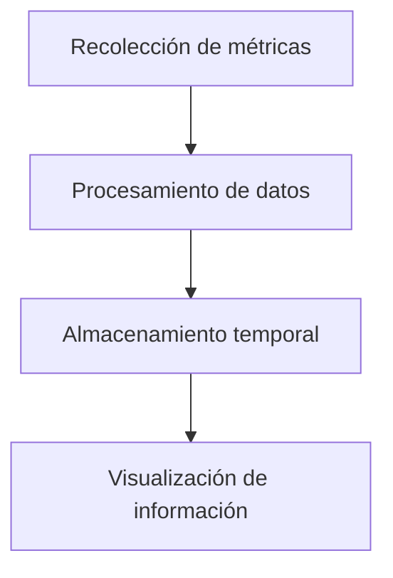

# Flujo de datos en el sistema Pulso

Este documento describe cómo fluye la información dentro del sistema Pulso desde la recolección de métricas hasta la visualización de datos.

---

## 1. Recolección de datos

Pulso obtiene información del sistema operativo relacionada con:

- Uso de CPU
- Memoria
- Red
- Procesos activos

### Componentes involucrados

- Módulo de métricas
- APIs del sistema operativo Linux
- Lectura de archivos como /proc/stat

---

## 2. Procesamiento de datos

Las métricas recolectadas son procesadas para organizar y normalizar la información.

### Componentes involucrados

- Parser de métricas
- Normalizador de datos
- Procesador interno

---

## 3. Almacenamiento temporal

Los datos procesados se almacenan temporalmente en memoria para su posterior consulta.

### Componentes involucrados

- Gestor de memoria
- Estructuras internas de datos

---

## 4. Visualización

La información procesada es presentada al usuario mediante la interfaz del sistema.

### Componentes involucrados

- Consola de monitoreo
- Sistema de salida de métricas

---

## Diagrama del flujo de datos

