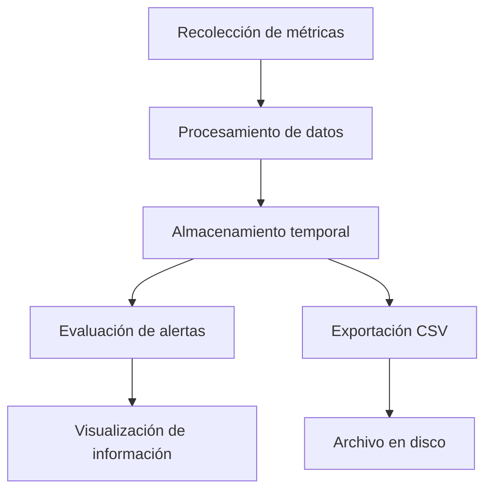

# Flujo de datos en el sistema Pulso

Este documento describe cómo fluye la información dentro del sistema Pulso desde la recolección de métricas hasta la visualización de datos.

---

## 1. Recolección de datos

Pulso obtiene información del sistema operativo relacionada con:

- Uso de CPU
- Memoria
- Red
- Procesos activos

### Componentes involucrados

- Módulo de métricas
- APIs del sistema operativo Linux
- Lectura de archivos como /proc/stat

---

## 2. Procesamiento de datos

Las métricas recolectadas son procesadas para organizar y normalizar la información.

### Componentes involucrados

- Parser de métricas
- Normalizador de datos
- Procesador interno

---

## 3. Almacenamiento temporal

Los datos procesados se almacenan temporalmente en memoria para su posterior consulta.

### Componentes involucrados

- Gestor de memoria
- Estructuras internas de datos

---

## 4. Visualización

La información procesada es presentada al usuario mediante la interfaz del sistema.

### Componentes involucrados

- Consola de monitoreo
- Sistema de salida de métricas

---
## 5. Evaluación de alertas

Después de recolectar las métricas mediante `collectAll`, el componente `SystemMonitor` genera un snapshot del estado actual del sistema y lo envía al `GestorAlertas`.

El `GestorAlertas` evalúa cada instancia de `AlertaUmbral` configurada para determinar si alguna condición de alerta ha sido alcanzada. Cuando una alerta se dispara, se ejecuta el callback asociado y se registra el evento correspondiente en los mecanismos de logging del sistema.

### Componentes involucrados

* SystemMonitor
* collectAll
* GestorAlertas
* AlertaUmbral
* Callback de alertas
* Sistema de logs

---

## 6. Exportación de datos

Los datos almacenados pueden exportarse a archivos CSV para su análisis posterior. El componente `Storage` proporciona la funcionalidad `exportToCSV`, que toma los datos disponibles y genera un archivo CSV en disco.

Este proceso permite conservar métricas históricas y compartir información con herramientas externas de análisis.

### Componentes involucrados

* Storage
* exportToCSV
* Archivo CSV
* Sistema de archivos

---

## Diagrama del flujo de datos

```mermaid
flowchart TD
    A[Recolección de métricas] --> B[Procesamiento de datos]
    B --> C[Almacenamiento temporal]
    C --> D[Evaluación de alertas]
    D --> E[Visualización de información]
    C --> F[Exportación CSV]
    F --> G[Archivo en disco]
```
