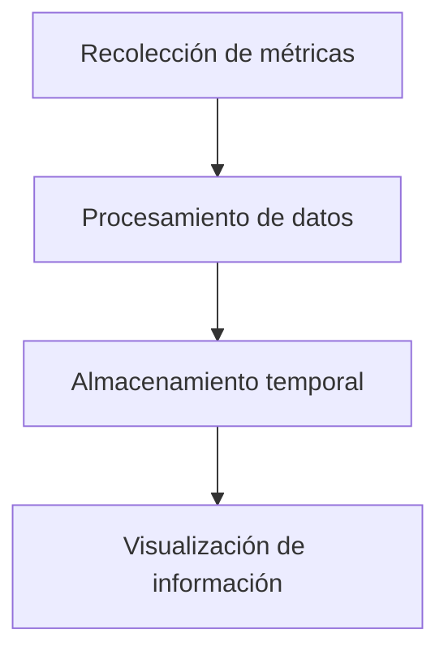
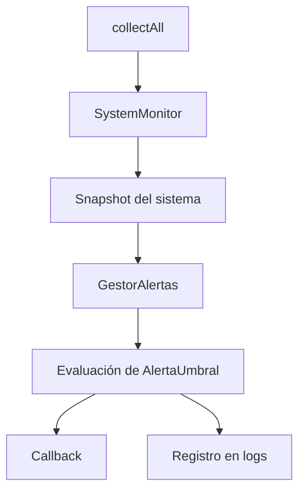
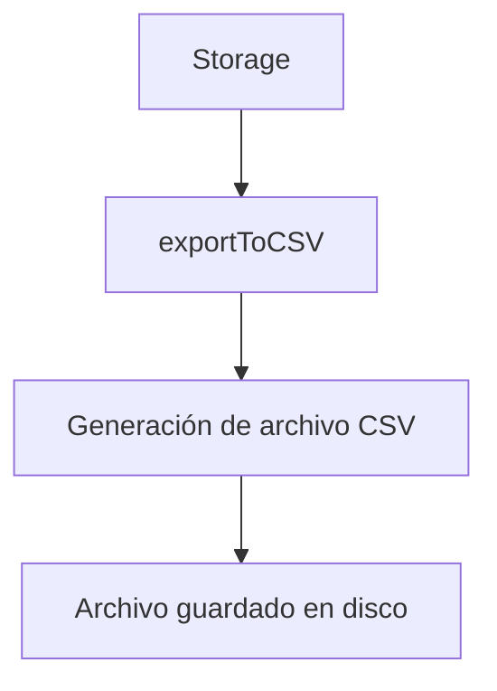

# Flujo de datos en el sistema Pulso

Este documento describe cómo fluye la información dentro del sistema Pulso desde la recolección de métricas hasta la visualización de datos.

---

## 1. Recolección de datos

Pulso obtiene información del sistema operativo relacionada con:

- Uso de CPU
- Memoria
- Red
- Procesos activos

### Componentes involucrados

- Módulo de métricas
- APIs del sistema operativo Linux
- Lectura de archivos como /proc/stat

---

## 2. Procesamiento de datos

Las métricas recolectadas son procesadas para organizar y normalizar la información.

### Componentes involucrados

- Parser de métricas
- Normalizador de datos
- Procesador interno

---

## 3. Almacenamiento temporal

Los datos procesados se almacenan temporalmente en memoria para su posterior consulta.

### Componentes involucrados

- Gestor de memoria
- Estructuras internas de datos

---

## 4. Visualización

La información procesada es presentada al usuario mediante la interfaz del sistema.

### Componentes involucrados

- Consola de monitoreo
- Sistema de salida de métricas

---

## Diagrama del flujo de datos


```mermaid
flowchart TD
    A[Recolección de métricas] --> B[Procesamiento de datos]
    B --> C[Almacenamiento temporal]
    C --> D[Visualización de información]
```  
## 5. Flujo de evaluación de alertas

Después de la recolección de metricas mediante `collectAll()`, el sistema genera un snapshot con estado actual de los recursos monitoreados. Este anapshop es enviado al `GestorAlertas`, el cual es el encargado de todas las alertas configuradas.
Cada instancia de `AlertaUmbral` compara los valores actuales contra los límites definidos. Cuando una condición supera el umbral establecido, el gestor ejecuta el callback correspondiente y registra el evento para su posterior análisis.

### Componentes involucrados

- collectAll()
- SystemMonitor
- GestorAlertas
- Callback de alerta
- Sistema de logs

---

## Diagrama del flujo de datos


```mermaid
flowchart TD
    A[collectAll] --> B[SystemMonitor]
    B --> C[Snapshot del sistema]
    C --> D[GestorAlertas]
    D --> E[Evaluación de AlertaUmbral]
    E --> F[Callback]
    E --> G[Registro en logs]
```

---

## 6. Flujo de exportación de datos

Las métricas almacenadas temporalmente pueden exportarse para un análisis externo o almacenamiento permanente.

El componente `Storage` recupera la información disponible y utiliza la función `exportToCSV()` para generar un archivo CSV que posteriormente es guardado en disco.

### Componentes involucrados

- Storage
- exportToCSV()
- Generador CSV
- Sistema de archivos

### Diagrama del flujo de exportación


```mermaid
flowchart TD
    A[Storage] --> B[exportToCSV]
    B --> C[Generación de archivo CSV]
    C --> D[Archivo guardado en disco]
```

```
```
