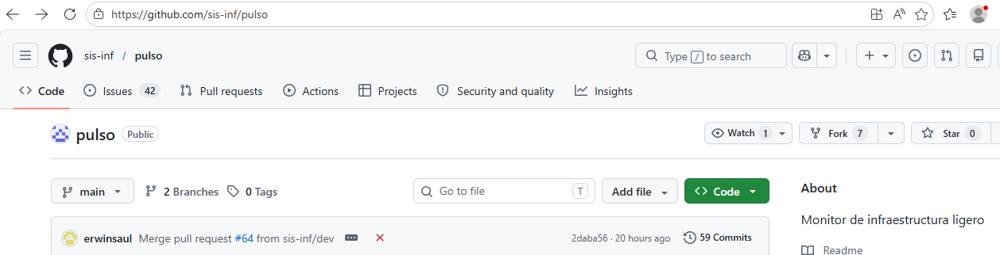
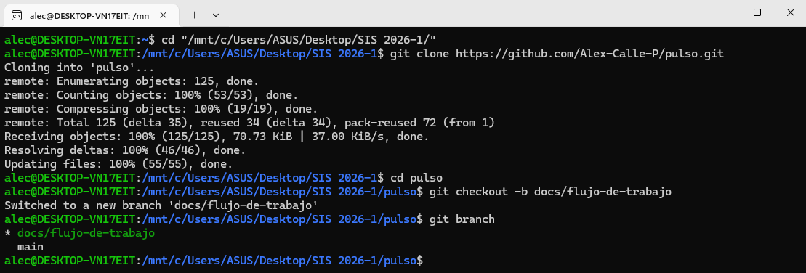
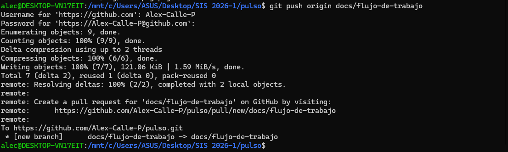
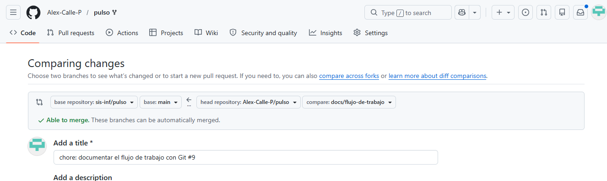

# Guía Paso a Paso: Forking Workflow

Este documento describe las tecnicas y primeros pasos para el proycto.

## 1. Cómo hacer Fork
Para iniciar se debe realizar un Fork del repositorio principal a la cuenta personal. Esto crea una copia exacta para trabajar sin afectar el proyecto original.

## 2. Como crear una rama
Es fundamental trabajar en ramas descriptivas. Usamos el comando `git checkout -b nombre-rama` para crearla y movernos a ella.

## 3. Cómo hacer Commit y Push
Una vez realizados los cambios se guardan con un commit descriptivo y se suben a GitHub con el comando push.

## 4. Cómo abrir un Pull Request
Finalmente en GitHub se solicita la integración de los cambios mediante un Pull Request hacia la rama `dev` del proyecto principal.
